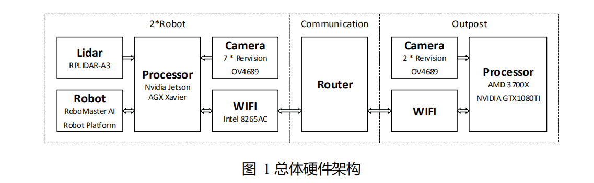
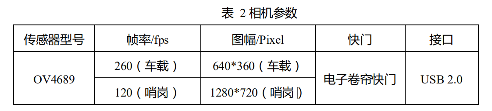
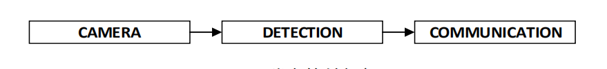
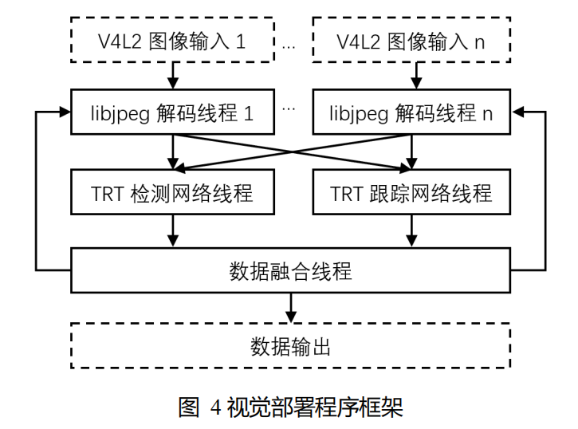
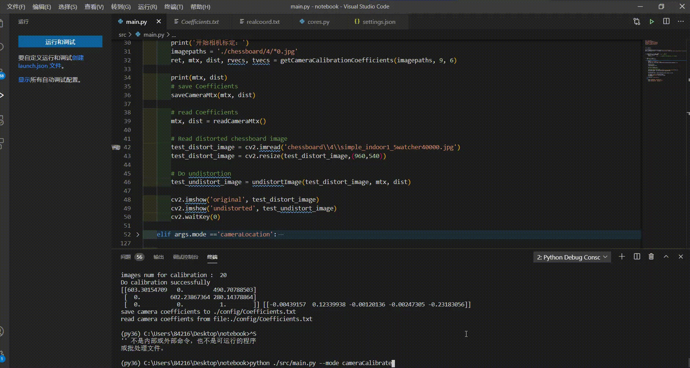
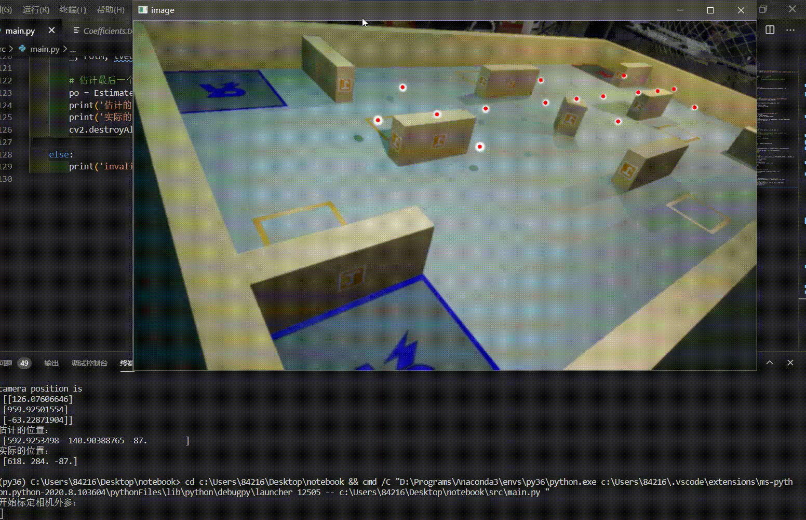

<!--
 * @Author: your name
 * @Date: 2020-08-19 08:51:28
 * @LastEditTime: 2020-08-23 20:30:50
 * @LastEditors: Please set LastEditors
 * @Description: In User Settings Edit
 * @FilePath: \notebook\README.md
-->
# 要求
b) 软件功能介绍   
c) 软件效果展示。需要体现整体项目的创新性和优势，结合可视化数据（例如视频网址，gif 图，测试图表等）对最终效果进行展示与定量分析   
d) 依赖工具、软硬件环境   
e) 编译、安装方式   
f) 文件目录结构及文件用途说明   
g) 软件与硬件的系统框图，数据流图   
h) 原理介绍与理论支持分析   
i) 软件架构或层级图   
j) 代码规范   
k) 是否存在开源协议   
l) 函数、变量命名是否规范、统一   
m) 关键功能函数、变量是否存在清晰的注释   
n) 整体可编译可运行，容易测试，包含不同情况下   
的测试脚本或涵盖集成测试   
o) 是否遵循某种设计模式   

# 视觉部分  

## 1 硬件方案  

机器人和哨岗的硬件架构如图 1 所示。  
  

具体的视觉传感器参数如下：  
- **相机** : USB 相机 OV4689  
    机器人上共安装了 7 个 USB 相机，包括云台顶部安装 1 个 90°视场的云台相机，底盘四周安装 6 个 120°视场的环视相机，以实现车体全视场覆盖。哨岗使用 2 个120°视场的 USB 相机。相机的其它参数如表 2 所示。  
    
    
- **车载处理器** ： NVIDIA Jetson AGX Xavier
    * 8 核 ARM v8.2 CPU，运行频率为 2.2656GHz
    * 512 核 Volta GPU，带 Tensor Core，可提供 11 TFLOPS(FP16) 算力
    * 2 个 NVDLA 引擎，可提供 5 TFLOPS(FP16) 算力
- **基站处理器** ：  
    * AMD R7 3700X CPU，8 核 16 线程，运行频率 3.6GHz
    * NVIDIA GTX 1080TI GPU，可提供 11.34 TFLOPS(FP32) 算力

## 2 软件设计  
机器人系统包含 6 个功能模块：检测、定位、路径规划、射击、策略、通讯。其软 件主体架构可简化为下图所示。  
  

哨岗系统包含 2 个功能模块：检测、通讯，其软件主体架构如下图所示。 
  

### 2.1 车载相机检测  

- **算法设计**
   * 算法采用基于深度学习，为了充分利用车载处理器 GPU 并行计算的速度优势，环视检测与云台检测独共享相同的网络模型。  

   * 为了进一步提高检测精度和速度，我们设计的目标检测算法包含两个网络模型。两个检测模型前端都基于 MobileNetV2，检测端都基于  YOLOv3，并对结构进行了裁剪修正缩小模型大小。大模型保留两个尺度检测层，减少目标尺度变化影响，提升远距离小目标的识别率。小模型以大模型检测结果为基础，在图像中裁出包含机器人的区域，再缩放为统一尺寸。由于图幅较小，目标尺度变化不大，故小模型只保留一个检测层，在获得更快速度的同时能实现比大模型更高的精度。  
   * 算法流程如图  
   
* **算法部署**  

    采用多线程并行处理，使用 C 语言调用 TensorRT 库提高系统性
能、降低延迟。程序框图如下图所示。  
  

    该部署方案有以下优势：  

    * GPU 效率最大化：同时运行过多 TensorRT 引擎会降低 GPU 整体运行效率，因此每个网络只使用一个 TensorRT 引擎，每个引擎设置合适大小的 BATCH_SIZE， 并使用独立线程循环运行 TensorRT 引擎以实现 GPU 效率最大化。得益于 Xavier的内存显存共用架构，程序可通过内存映射方式直接管理操作 GPU 锁页内存，配合环形缓冲区机制最大程度提高 GPU 运行效率。  

    * 高精度图像时间戳：考虑到射击与运动估计部分对图像时间戳误差敏感，且OpenCV 解码过程中将多种误差源耦合在一起，滤波效果不好，因此使用 V4L2 获取最精确的图像时间戳。V4L2 还可以精确控制摄像头曝光时间等变量。  

    * 负载平衡问题：多摄像头解码占用大量 CPU 资源（7%每摄像头），为降低 CPU 负载，我们设计了摄像头分配算法，根据数据融合结果丢弃部分无目标摄像头的原始数据（不解码），只根据先前检测与结果对部分摄像头数据进行解码及后 续处理。此外，检测网络不需要以较高速度执行，我们设计 GPU 算力分配算法，限制检测网络的运行频率，从而提升跟踪网络频率。  

对上述设计与部署方案实测之后，我们同时实现了图像解码用时 1.8ms，检测网络 (BatchSize=4)用时 5ms，跟踪网络(BatchSize=2)用时 2.5ms，并行运行下图像处理总延迟控制在 5ms 以内。为了给决策以及其它算法保留算力，我们对视觉频率进行了限制，最后实现检测了算法频率 52FPS，跟踪算法频率 260FPS，在环视摄像头 120 度视场角的情况下基本实现对场地内任意距离的敌方机器人与装甲板进行检测与跟踪。相比技术方 案阶段云台检测 70FPS，环视检测 30FPS 有极大的提升。相关工作已在 2020 年 1 月完 成测试。
在 260Hz 条件下，当己方机器人未处于高速旋转时，前后两帧图像中的变化非常细微。经推算，当目标以 3m/s 的速度运动时，两帧间的运动位移仅为 1.2cm。依靠高频率的视频检测，后续我们可以实现对敌方机器人的装甲板匹配与运动状态估计。  
之后，我们经过几何变换求出敌方机器人相对自身的角度，再结合激光雷达估计敌方机器人的相对位置，最后与哨岗检测算法估计出的机器人位置融合来得到最终的位置估计。  


### 2.3 视觉仿真环境  

利用 Unreal Engine 4 搭建的仿真环境，可以同时渲染机器人各个相机的图像及对应的训练标注。通过在仿真环境中可以更改赛场光线与纹理条件，以较低成本实现数据扩充与迁移。视觉仿真环境还可以联合其他仿真环境，实现比赛可视化。

加动图


### 2.2 哨岗检测算法  

- 哨岗检测算法基于 YOLOv3 设计，并进行适当的裁剪和优化。由于哨岗的视野较大，即使机器人迅速移动，在哨岗的图像中移动也不是很快，所以 60FPS 的检测频率即 可满足要求。我们添加了 SPP 层减少远近目标尺度变化带来的影响。此外，较大的视野导致很多小目标出现，所以我们保留了 YOLOv3 的三个尺度检测层。

- 为了估计敌方机器人的朝向，我们在哨岗检测算法中除了检测敌方机器人车身以外，还将不同方向的装甲板分别编码（前后左右），由坐标转换估计机器人和不同装甲板的位置信息，然后通过装甲板和机器人匹配，估计出敌方机器人的朝向。最后，将哨岗估计的机器人位姿信息与车载相机估计的位姿信息融合，得到最终的机器人位姿信息。

- 由于比赛准备阶段需要安装哨岗摄像头，装配误差可能导致解算误差较大，我们通过在场地上放置的视觉标签进行快速标定，算法已经在仿真环境中测试。

## 部分代码展示  

本部分仅展示哨岗相机自动标定及从图像坐标系到世界坐标系的转换部分代码 

原理见[链接](https://docs.opencv.org/2.4/modules/calib3d/doc/camera_calibration_and_3d_reconstruction.html#double%20calibrateCamera(InputArrayOfArrays%20objectPoints,%20InputArrayOfArrays%20imagePoints,%20Size%20imageSize,%20InputOutputArray%20cameraMatrix,%20InputOutputArray%20distCoeffs,%20OutputArrayOfArrays%20rvecs,%20OutputArrayOfArrays%20tvecs,%20int%20flags,%20TermCriteria%20criteria))

```
.
├── Readme.md
├── src                         
│   ├── watcherCalibrate.py                // 主要函数
│   └── main.py                            // 测试程序
├── config
│   ├── Coefficients.txt                   // 相机内参
│   └── Extrinsicparam.txt                 // 相机外参
└── asserts                                // 其他材料，如棋盘格图片
```

### 1.运行环境  

python3，需要opencv 3.4、numpy  

```
git clone https://github.com/NewYinbao/notebook
cd notebook
pip install -r requirements.txt
```  

### 2. 相机内参标定测试

```
python ./src main.py --mode cameraCalibrate
```

运行效果



### 3. 相机外参标定测试  

运行下列代码，鼠标点击（不需要精确到像素）顺序与```./asserts/realcoord.txt```中定义的世界坐标对应
```
python .src/mian.py --mode cameraLocation
```

运行效果  




## Contributing
Pull requests are welcome. For major changes, please open an issue first to discuss what you would like to change.

Please make sure to update tests as appropriate.

## License
[MIT](https://choosealicense.com/licenses/mit/)
