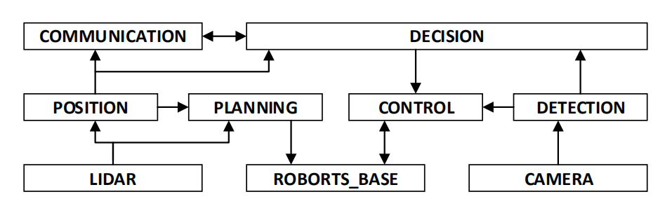
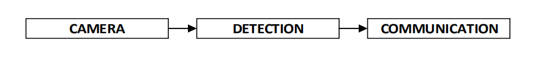

<!--
 * @Author: your name
 * @Date: 2020-08-01 08:51:28
 * @LastEditTime: 2020-08-25 20:12:25
 * @LastEditors: Please set LastEditors
 * @Description: In User Settings Edit
 * @FilePath: ./README.md
-->


# HITCSC：视觉感知组代码示例

<tab>本项目为哈尔滨工业大学 HITCSC 队伍在 RM AI Challenge 2020 比赛中视觉感知组组代码示例。

## 1 硬件方案  

机器人和哨岗的硬件架构如图 1 所示。  
  

具体的视觉传感器及处理器参数如下：  

- **相机** : USB 相机 OV4689  

    机器人上共安装了 7 个 USB 相机，包括云台顶部安装 1 个 90°视场的云台相机，底盘四周安装 6 个 120°视场的环视相机，以实现车体全视场覆盖。哨岗使用 2 个120°视场的 USB 相机。相机的其它参数如表 1 所示。  

    <p align="center">表 1 相机参数</p>
    <table align="center">
        <tr>
            <td>传感器型号</td>
            <td>帧率/fps</td>
            <td>图幅/Pixel</td>
            <td>快门</td>
            <td>接口</td>
        </tr>
        <tr>
            <td rowspan="2">OV4689</td>
            <td>260 (车载)</td>
            <td>640*360 (车载)</td>
            <td rowspan="2">电子卷帘快门</td>
            <td rowspan="2">USB 2.0</td>
        </tr>
        <tr>
            <td>120 (哨岗)</td>
            <td>1280*720 (哨岗)</td>
        </tr>
    </table>
    
- **车载处理器** ： NVIDIA Jetson AGX Xavier
    * 8 核 ARM v8.2 CPU，运行频率为 2.2656GHz
    * 512 核 Volta GPU，带 Tensor Core，可提供 11 TFLOPS(FP16) 算力
    * 2 个 NVDLA 引擎，可提供 5 TFLOPS(FP16) 算力
- **哨岗处理器** ：  
    * AMD R7 3700X CPU，8 核 16 线程，运行频率 3.6GHz
    * NVIDIA GTX 1080TI GPU，可提供 11.34 TFLOPS(FP32) 算力

## 2 软件设计  
机器人系统包含 6 个功能模块：检测、定位、路径规划、射击、策略、通讯。其软件主体架构可简化为下图所示。  
  

哨岗系统包含 2 个功能模块：检测、通讯，其软件主体架构如下图所示。 
  

### 2.1 视觉仿真环境  

利用 Unreal Engine 4 搭建的仿真环境，具备以下功能：  

- 渲染机器人各个相机的图像及对应的训练标注。  

- 通过更改光照纹理，以较低成本实现数据扩充与迁移。  

- 设置机器人关键点，或者键盘操控机器人，生成不同视角图像。  

- 视觉仿真环境还可以联合其他仿真环境，实现比赛可视化。  

    


### 2.2 车载相机检测  

* **算法设计**
   * 算法采用基于深度学习，为了充分利用车载处理器 GPU 并行计算的速度优势，环视检测与云台检测独共享相同的网络模型。  

   * 为了进一步提高检测精度和速度，我们设计的目标检测算法包含一大一小两个网络模型，以不同速度并行运行。算法流程如下图。

      
   
* **算法部署**  

    采用多线程并行处理，使用 C 语言调用 TensorRT 库提高系统性能、降低延迟。程序框图如下图所示。  
      

    该部署方案有以下优势：  

    * **GPU 效率最大化**  
    得益于 Xavier的内存显存共用架构，程序可通过内存映射方式直接管理操作 GPU 锁页内存，配合环形缓冲区机制最大程度提高 GPU 运行效率。将图片打包成batch输入到模型，提高GPU效率。

    * **高精度图像时间戳**  
    相较于 opencv 解码，使用 V4L2 获取最精确的图像时间戳。V4L2 还可以精确控制摄像头曝光时间等变量。  

    * **负载平衡问题**  
    根据数据融合结果丢弃部分无目标摄像头的原始数据（不解码），减少了解码摄像头的 CPU 负载；  
    设计 GPU 算力分配算法，限制检测网络的运行频率，提升跟踪网络频率。  

    对上述设计与部署方案实测之后，我们同时实现了图像解码用时 1.8ms，检测网络 (BatchSize=4)用时 5ms，跟踪网络(BatchSize=2)用时 2.5ms，并行运行下图像处理总延迟控制在 5ms 以内。  
    为了给决策以及其它算法保留算力，我们对视觉频率进行了限制，最后实现检测了算法频率 52FPS，跟踪算法频率 260FPS，在环视摄像头 120 度视场角的情况下基本实现对场地内任意距离的敌方机器人与装甲板进行检测与跟踪。  

* **敌方机器人位置估计**  
根据检测结果，经过几何变换求出敌方机器人相对自身的角度，再结合激光雷达估计敌方机器人的相对位置，最后与哨岗检测算法估计出的机器人位置融合来得到最终的位置估计。  

### 2.3 哨岗检测算法  

- **模型设计**  
哨岗检测算法基于 YOLOv3 设计，并进行适当的裁剪和优化；保留了 YOLOv3 的三个尺度检测层；添加了 SPP 层减少远近目标尺度变化带来的影响。速度 60 FPS。  

- **检测装甲板朝向**  
将不同方向的装甲板分别编码（前后左右）；由坐标转换估计机器人和不同装甲板的位置信息，然后通过装甲板和机器人匹配，估计出敌方机器人的朝向。最后，将哨岗估计的机器人位姿信息与车载相机估计的位姿信息融合，得到最终的机器人位姿信息。  
    
- **快速标定算法**  
通过在场地上放置的视觉标签进行快速标定，算法已经在仿真环境中测试。

## 部分代码展示  

本部分仅展示哨岗相机自动标定及从图像坐标系到世界坐标系的转换部分代码 

原理见[链接](https://docs.opencv.org/2.4/modules/calib3d/doc/camera_calibration_and_3d_reconstruction.html#double%20calibrateCamera(InputArrayOfArrays%20objectPoints,%20InputArrayOfArrays%20imagePoints,%20Size%20imageSize,%20InputOutputArray%20cameraMatrix,%20InputOutputArray%20distCoeffs,%20OutputArrayOfArrays%20rvecs,%20OutputArrayOfArrays%20tvecs,%20int%20flags,%20TermCriteria%20criteria))

```
.
├── Readme.md
├── src                         
│   ├── watcherCalibrate.py                // 主要函数
│   └── main.py                            // 测试程序
├── config
│   ├── Coefficients.txt                   // 相机内参
│   └── Extrinsicparam.txt                 // 相机外参
└── asserts                                // 其他材料，如棋盘格图片
```

### 1.运行环境  

python3，需要opencv 3.4、numpy  

```
git clone https://github.com/NewYinbao/notebook
cd notebook
pip install -r requirements.txt
```  

### 2. 相机内参标定测试

```
python ./src main.py --mode cameraCalibrate
```

运行效果


### 3. 相机外参标定测试  

运行下列代码，鼠标点击（不需要精确到像素）顺序与```./asserts/realcoord.txt```中定义的世界坐标对应
```
python .src/mian.py --mode cameraLocation
```

运行效果  


## 开源协议

本代码遵循[MIT](https://choosealicense.com/licenses/mit/)协议。  